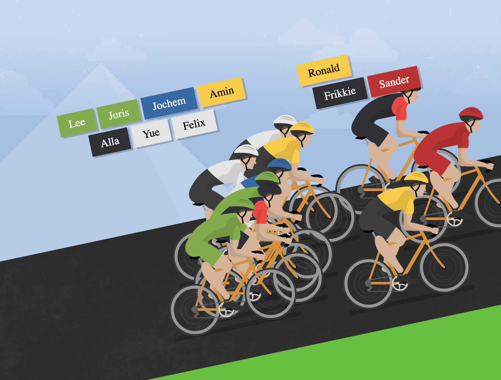

# Welcome to the Mountain!

Hiking, skiing, surfing, cycling? Looks like Team Relive decided to grab some bikes and head into the mountains this year.

This project is a simple framework for a game / visualization of our adventure!

# Getting started

    yarn install

## Server

The Node.js server is located in `/server`, it has two simple API methods to return information about the players and starting position of the players in the game.

To run the Node.js server:

    yarn server

(initially, this will have compilation errors which are expected)

## Client web app

To run webpack dev server.

    yarn start

This should open up your browser and automatically reload when there are code changes. You will see a cyclist heading up the mountain.

Click the name tag above him to give him a little push forward!

(Yes; something is wrong with his leg - don't worry about it)

### Resolution

Currently, the game has been developed for 1920x1080 and Google Chrome.

[Configure Chrome Devtools Device Mode](https://developers.google.com/web/tools/chrome-devtools/device-mode/) tools to use the right resolution.

# Assignment

Make sure you've blocked a couple of hours. Once you're ready for it, let's go:

-   **Fork this project**. Only work on your fork (also, don't create PRs to the main project, so other people can't see steal your solutions).
-   When moving to the next assignment, branch from your previous solution
-   After every assignment, you'll create a PR. Do this as you regularly would; but you can also explain your thought process (what paths did you try before coming to your solution), issues you ran into, etc.
-   We'll look at commit / push times to see which exercises went smooth and which took longer. No worries; some are expected to take quite a bit!

Before looking at the assignments below, set your start-time by pushing a commit to master; add yourself to `server/players.ts` so you will appear in the game later on! (no need to fix the build yet - and this will be your only commit to master).

Done?

Let's get started with the next steps:

1. [Part 1: Server-side](assignment/1.md)
1. [Part 2: Widgets](assignment/2.md)
1. [Part 3: Don't collide](assignment/3.md)

(cyclist CSS based on http://files.benjaminbouwyn.com/velo/montagne.html)
