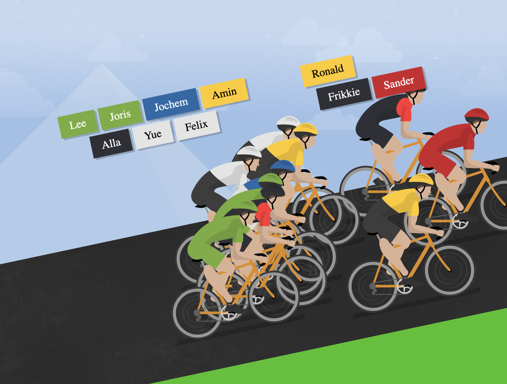

# Part 3: Don't collide

How are your UX chops? Did you already get annoyed by all the overlapping name tags above the players?

Let's fix this with some a smarter layouting algorithm! When placing a NameTag, we want to make sure to place it in a position where it doesn't collide with existing NameTag widgets.

The result should look like this:

Can you implement this in `freePosition.ts`?

_Tip: your algorithm should keep on working when you click NameTag's (give riders a push). This makes it easier to test. It is expected the NameTag can make "jumps" as a new position is closer when the rider overtakes someone_

## Done?

That's a wrap! Make sure to push everything. Write down any feedback you have on the exercises, codebase, or related - should be good input for discussion!
